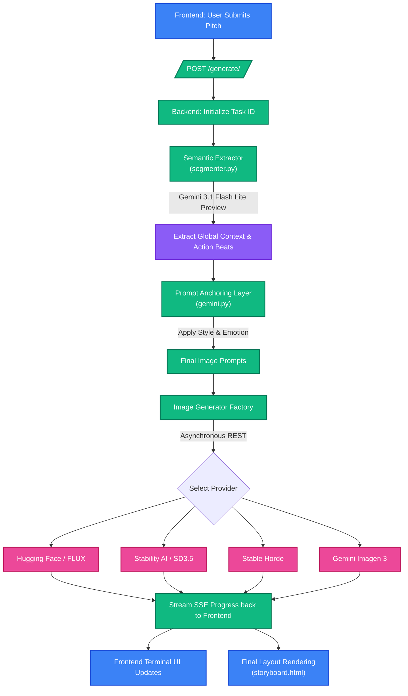
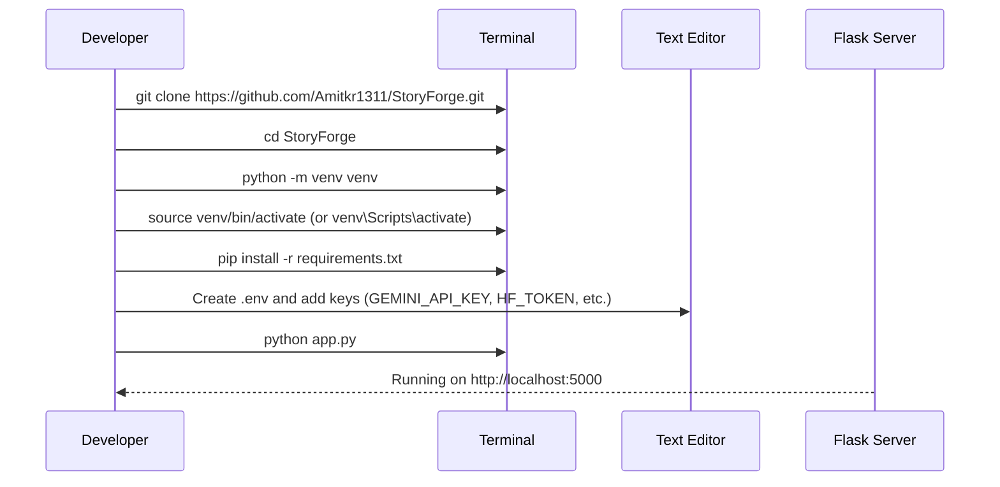

<p align="center">
  
</p>

# 🪄 StoryForge (Pitch Visualizer)

Turn plain business narratives into beautiful, cohesive 3-5 panel visual storyboards instantly.

StoryForge uses AI specifically tuned for narrative arc extraction, consistent prompt framing, and literal scene generation to help founders, writers, and marketers visualize their pitches without hallucination or style drift.

---

## 📸 Overview

StoryForge is a dynamic, end-to-end pipeline that takes boring corporate text and translates it into a premium, cinematic storyboard. It leverages a combination of **Gemini** (for semantic extraction and prompt engineering) and the latest image generation models like **FLUX.1-schnell** (via Hugging Face) and **Stable Diffusion 3.5**.

### 🌟 Key Features & Recent Updates
- **Dynamic Storyboard Generation**: Automatically extracts 3 to 5 distinct scenes from raw text.
- **Context Consistency (Anti-Hallucination)**: Extracts a "Global Context" (industry, setting, subjects) to anchor visual generation across all panels to prevent style drift.
- **Robust Asynchronous Pipeline**: Uses streaming Server-Sent Events (SSE) to provide a real-time, hacker-style terminal UI that updates users on the active state of their background generations.
- **Fail-Safe Error Handling**: Prevents UI deadlocks by actively parsing dirty payloads, gracefully shutting down streaming connections on failures, and correctly surfacing accurate provider errors (e.g., Hugging Face `402 Payment Required` vs generic timeouts).
- **Emotional Arc Mapping**: Adjusts lighting and mood based on the scene's chronological position (e.g., tense openings, triumphant conclusions).
- **Multiple Image Engines**: Supports Hugging Face (Flux.1), Stable Horde, Stability AI, and Gemini.

---

## 🏗 Architecture & Pipeline

The application runs on a modular Python Flask backend and a vanilla JavaScript frontend. When a user submits a narrative, it flows through a sequential, anti-hallucination pipeline.



---

## 🧠 Prompt Engineering Methodology

Our prompt pipeline is designed to eliminate the two biggest issues with AI storyboarding: **Style Drift** and **Subject Hallucination.**

1. **Anchored Context (Layered Build)**: We decouple the "action" from the "environment." By extracting the global environment *first* and appending it manually to every single prompt, the image model is mathematically forced to render the exact same settings and characters in Panel 5 as it did in Panel 1.
2. **Low-Temperature Literal Translation**: When `gemini.py` writes the final image generation prompt, it runs at `temperature=0.35`. We explicitly instruct it to act as a *literal visual translator*, strictly forbidding it from inventing background characters or props not explicitly mentioned in the original text.
3. **Chronological Emotional Arcs**: We calculate `scene_index / total_scenes` to map emotions visually:
   - **Opening Panels**: Injected with descriptors like *"tense, heavy, representing a real visible problem"*.
   - **Middle Panels**: Injected with *"transitional, effort, momentum"*.
   - **Closing Panels**: Injected with *"resolved, expansive, successful"*.

---

## ⚙️ Setup & Installation

Follow these steps to get the project running locally. 



### 1. Clone & Environment
```bash
git clone https://github.com/Amitkr1311/StoryForge.git
cd StoryForge
python -m venv venv
# On Mac/Linux:
source venv/bin/activate 
# On Windows:
venv\Scripts\activate

pip install -r requirements.txt
```

### 2. API Key Management
Create a `.env` file in the project root (next to `app.py`) and add the keys you want to use. You can get your keys from the following official sites:

| Provider | Key Variable | Purpose | Where to get the Key |
| :--- | :--- | :--- | :--- |
| **Google Gemini** | `GEMINI_API_KEY` | Semantic extraction & prompt engineering | [Google AI Studio](https://aistudio.google.com/apikey) |
| **Hugging Face** | `HF_TOKEN` | FLUX.1-schnell image generation (Fast) | [HF Token Settings](https://huggingface.co/settings/tokens) |
| **Stability AI** | `STABILITY_API_KEY` | Stable Diffusion 3.5 generation | [Stability AI Dashboard](https://platform.stability.ai/account/keys) |
| **Stable Horde** | `STABLE_HORDE_KEY` | Free community-driven generation | [Stable Horde Site](https://stablehorde.net) |

Add them to your `.env` file like this:

```bash
GEMINI_API_KEY=your_gemini_key_here
HF_TOKEN=your_huggingface_token_here
STABILITY_API_KEY=your_stability_key_here
STABLE_HORDE_KEY=optional_key_here
```

**Notes:**
- If `GEMINI_API_KEY` is missing, the app will fall back to basic rule-based prompts.
- If `HF_TOKEN` or `STABILITY_API_KEY` are missing, those providers will be deactivated in the UI.
- `Stable Horde` is free and works without a key, but a key grants higher priority in the generation queue.

### 3. Execution
Run the development server natively:
```bash
python app.py
```
Open your browser and navigate to `http://localhost:5000`.

---

## 🚀 Usage Guide

1. **Input**: Type a corporate narrative or business pitch into the text box (minimum 3 sentences recommended).
2. **Style Selection**: Choose your desired visual style (e.g., Cinematic, Digital Art, Corporate Minimal).
3. **Engine Selection**: Select an Image Engine (e.g., Hugging Face Pro or Stability AI).
4. **Context Engine**: Keep "SUPERCHARGE PROMPTS (Gemini Flash)" checked to enable anti-hallucination context extraction.
5. **Generate**: Click **GENERATE STORYBOARD**.
6. **Watch the Terminal**: The SSE streaming pipeline will update the frontend terminal with live status markers (extracting context, generating panels, etc).
7. **View**: In 5-15 seconds, the UI will swap to a beautiful, masonry-layout storyboard featuring your rendered panels.
